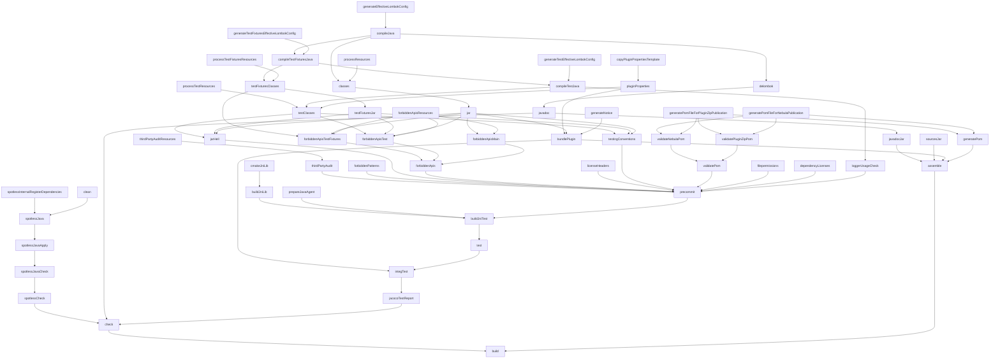

# Gradle Build Task Graph

Dependency DAG with transitive dependencies removed for clarity.

Prompt AI with questions like 'Analyzing GRADLE_GRAPH.md, does buildJniTest come before integTest?'

Regenerate with `./gradlew generateTaskGraph`

